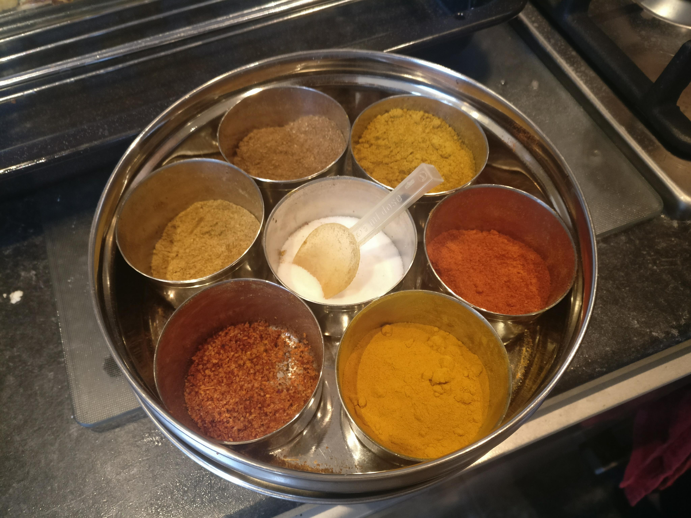
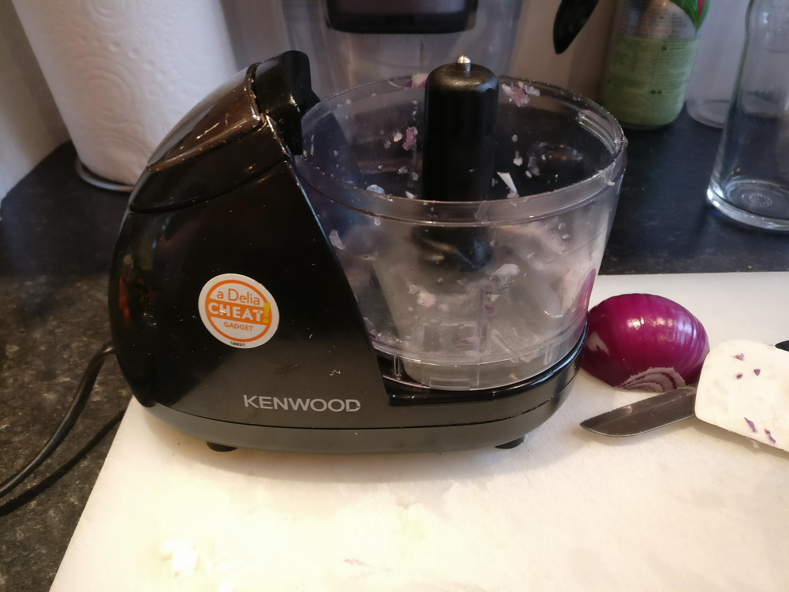

# Dad's Cooking

Here you'll find some recipes to home made indian food.  You'll notice that most indian food is super simple, comprised of 3 basic things:

 - The substance (fish, chicken, lentils, veg)
 - A masala
 - Spices (usually at least garam masala, red chilli powder and salt)

Good indian food is easy to make. Personally, the main things I have learnt should be emphasised are

 - Use enough salt
 - Use fresh ginger and garlic
 - Garam masala is _magical_

 I say use enough salt but it's pretty easy to go overboard. If you do that once, you probably won't do it again.

A refer to a couple of things in these recipes follow.

## A Spoon

Dad has this classic indian spice tin which is absolutely baller. It magics ingredients into food. There is always a spoon in the tin. Confusingly, a _spoon_ is also somewhat context dependant. 

 - A spoon of garam masala will probably be heaped
 - A spoon of salt almost definitely will not be

 Some experimentation is needed, but most of it is common sense. When I say a _spoon_ of some spice, I mean this spoon here, which I think is slightly smaller than a tea spoon.  

 ## A Grinder

 This is not to induce the munchies prior to eating. It's a mini-chopper type thing which is absolutely dope. I won't bother making a curry without it as it's too much hassle to chop ginger and garlic. They're like £20 on Amazon. Also if you're feeling super lazy you can also chuck the onion in there - you can make a chicken curry and clean up in a about 20 minutes with this bad boy.

